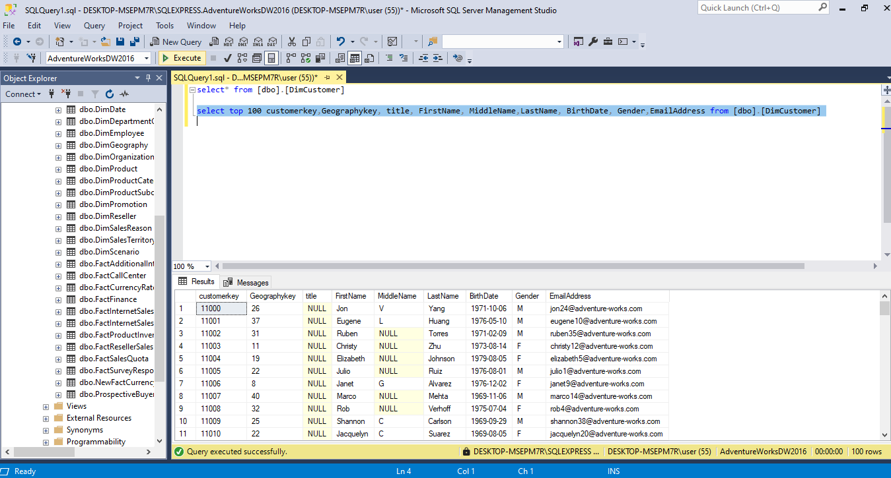
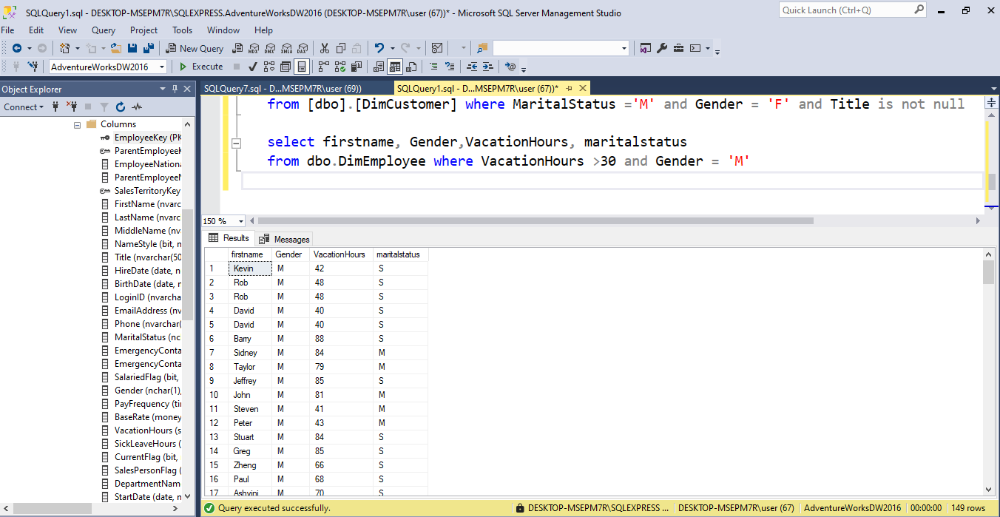
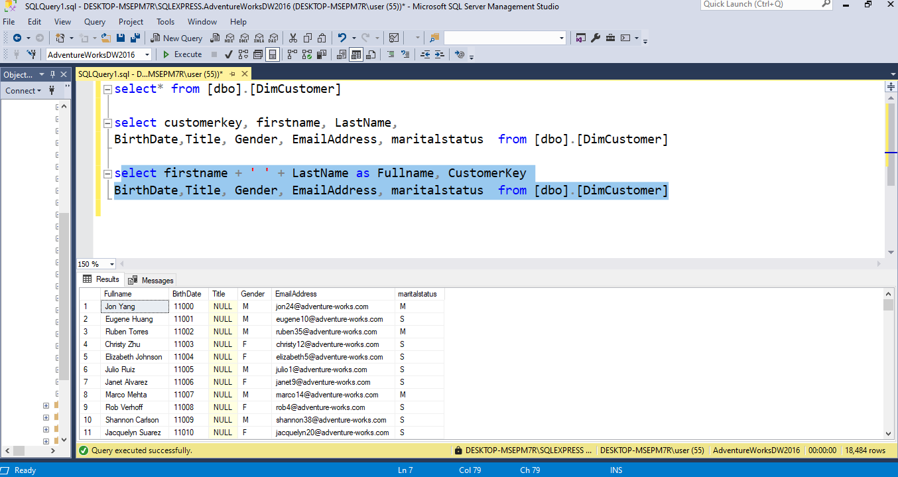
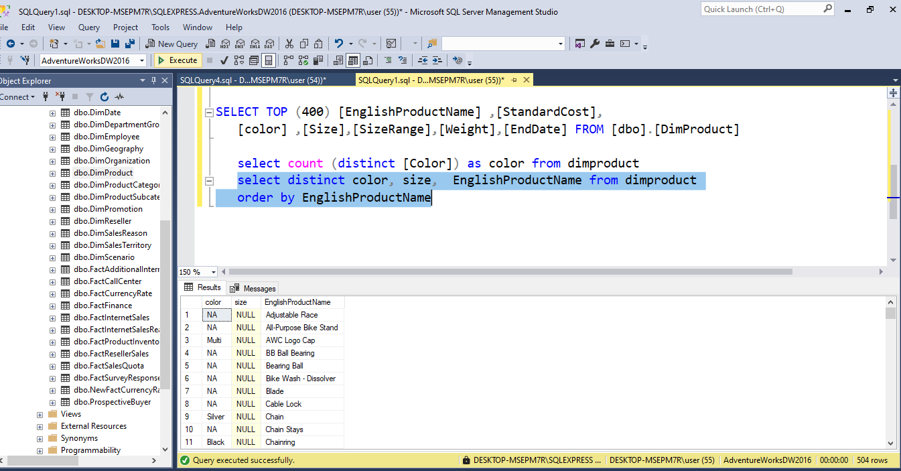
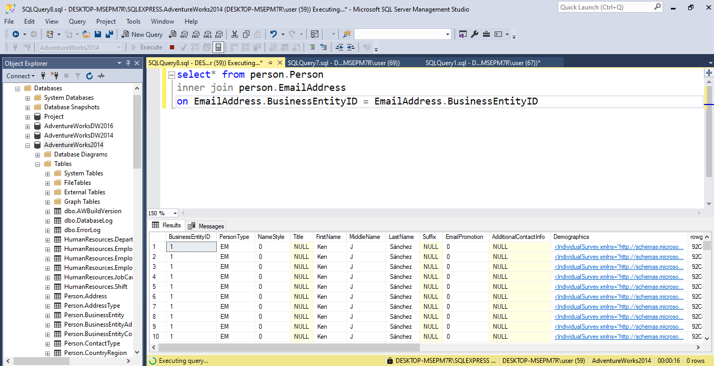
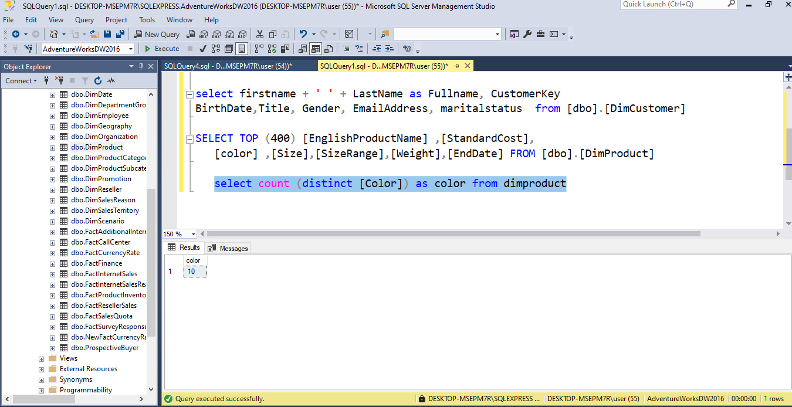
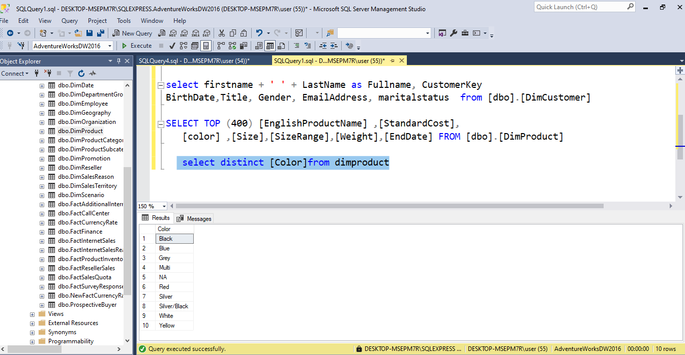

# SQL-data-exploration
Welcome to adventure works data exploration! Dive into the exciting world of SQL queries as we unravel adventure works database, querying and manipulating data.

## Introduction

This Project is about adventure works data exploration with expertise in SQL, I will guide you through a thrilling journey of Querying and analysing data, with commonly used query commands in SQL as examples.

## Skills demonstrated
----

The following query commands were incorporated:

- Select
- Where
- Concatenate using +
- Alias - AS
- NotNull
- Orderby
- Inner join
- Ieft join
- Count 
- Distinct.

## Select Statement

The select statement is a conerstone of querying databases. SELECT extracts data from one or more tables based on specified criteria, it retrieves data for analysis and decision-making.

In the image displayed below, the SELECT query was used to retrieve data of specific columns and the top 100 rows of data from the [dbo].[dimcustomer] table.

## Where Clause

The SQL WHERE clause acts as a filter, allowing you to extract specific data from a database table based on defined conditions. By specifying crietria in the WHERE clause, you can narrow down results of your queries, ensuring that only relevant data is retrieved for analysis or manipulation. 

The image below shows the WHERE CLAUSE with criterias that the data extracted must be staffs with **vacation hours greater than 30** and **gender = M (male).**

## Concatenate using +

The shortcut to concatenate columns or strings of texts into a string, is the **+** symbol. With this users can merge text or numeric values for more flexibility in data presentation and analysis. It is particularly useful for creating informative ouput.

## Alias - AS

An alias query in SQL allows users to assign temporary names to tables or columns within a query. The aliasing simplifies complex queries and imprves readabilityby providing shorthand references to database objects and facilitate efficient data retrieval.

The visual below shows the the first name and last name bieng merged together with **+** and space in between, represented by the empty quotes. The newly merged column is given a temporary name called **Full name** with the AS query.

## Notnull Query

The NOTNULL QUERY IN SQL is used to filter out records that contain empty or null values in a specified column. By incorporating the NOTNULL into a select statement users can retrieve only records where the designated column contains non-null data. 

The illustration below shows how the NOTNULL query was used to retrieve data that has filtered empty or null values in the title column.

## Order By Clause

The ORDER BY clause in SQL allows users to sort the result set of a query based on specified columns in ascending or descending order. By including Order By in a select statement, users can organize data according to thier preferences, facilitating easier interpretation and analysis.  

The illstration below shows the Select query is ordered in an ascending order, alphabetically, by the column **Englishproductname**.

## Inner join clause

The INNER JOIN clause is used to combine rows from two or more tables based on a related column between them. It selects records that have matching values in  both tables, according to the specified join conditions. it only retrieves data that meets specified criterias.  

## Left Join Clause

The left join clause in SQL retrieves all records from the left table (the table mentioned first in the query) and matched data from the right table (the table mentioned in the second query) based on a specified condition. If there are no matching records in the right table, NULL values are returned for the columns from the right side. It goes Vice versa for the Right Join clause.   

The image below illustrates the Left join clause as both tables are joined on BusinessentityID column.

## Count Function

The COUNT Function in SQL is used to count the number of rows that meet a specified condition within a table or result set. It can be used with the WHERE clause to count only the rows that statisfy certain criteria, or without any condition to count all rows. Count is an aggregate function used for statistical analysis, data validation and reporting purposes.

The graphics below shows the COUNT function being used with the DISTINCT funtion to extract the number of distinct colours in the Dim.product table.

## Distinct Function

The DISTINCT keyword in SQL is used to retrieve unique values from a specified column or combination of columns within a table. It filters out duplicate records and ensures that only distinct values are returned in the result set. This feature is particularly useful when querying data to identify unique entries or when performing data analysis where duplicate values are not required.

The image below shows how the Distinct function is used to retrieve unique values from duplicate values in a dataset.

## Conclusion
In conclusion, SQL offers a powerful set of tools and functionalities for querying and analysing data stored in relational databases. With commands such as SELECT, WHERE, JOIN, DISTINCT, and COUNT, users can manipulate and retrieve data with precision and efficiency. Whether organizing data, performing calculations or generating reports, SQL empowers users to extract valuable insights and make informed decisions based on structured data. 😃

## THANK YOU.
